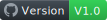
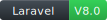

    

    
    

# Directions

Social network app for discussing every life topics such as Reddit ( Laravel , Livewire )

## Live Demo

<a href="https://www.my-directions.me/"> My-Directions.Me (Soon) </a>

## Languages and Technologies used:  

     &nbsp;
     &nbsp;
     &nbsp;
     &nbsp;
     &nbsp;
     &nbsp;

## Installation:

1. Clone the repo or download it and get into it
2. Run `composer install`
3. Run `npm install`
4. Rename or copy `.env.example` file to `.env`
5. Setup your database and email in `.env` file.
6. Run command `php artisan key:generate`
7. Run command `php artisan migrate:fresh --seed` to seed data
8. Run command `php artisan serve`
9. Browse `localhost:8000` in your browser

## Login Data: 

Admin:

`Email: admin@admin.com`

`password : admin`

User:

`Email: user@user.com`

`password : user`

## ScreenShoots From Project: 

 

 

 

 

 

## Todo in next Version:

1. Elastic Search
2. Moderators for communities
3. Chat between users